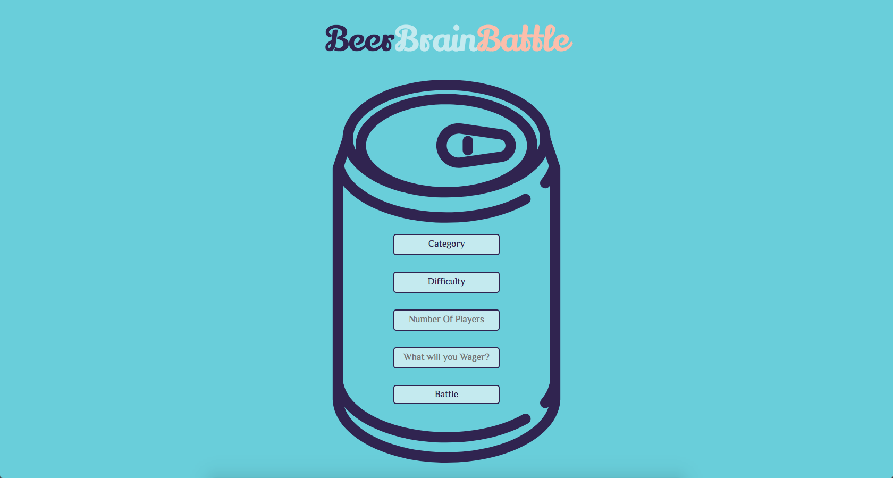
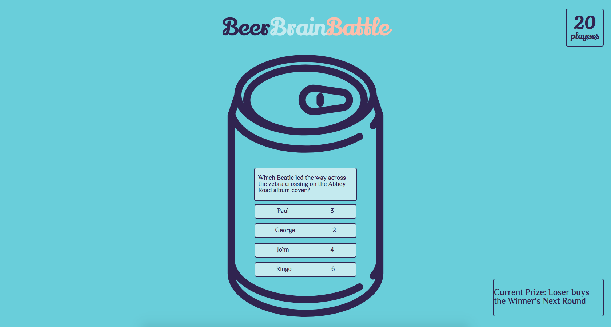
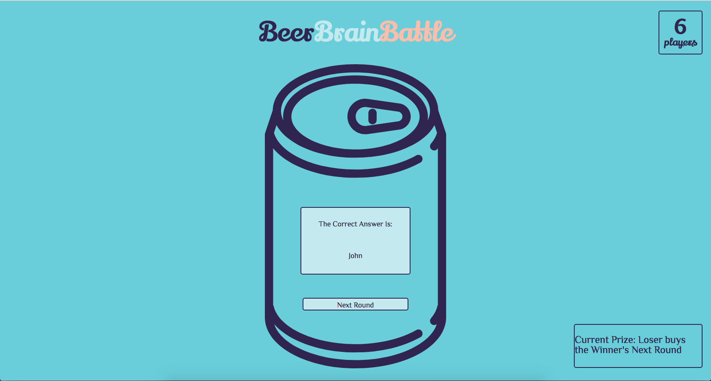
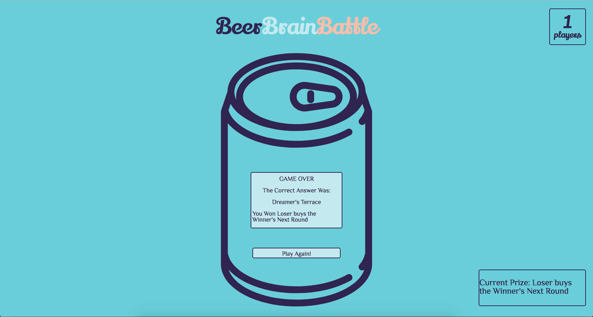

# BeerBrainBattle
## A React Redux Game to test your knowledge and challenge your friends for drinks.

Project spec can be found [here](http://frontend.turing.io/projects/binary-challenge.html).

## Setup Instructions 

npm install

npm start

## Tech Used

-React

-React-Router

-React-Redux

-Redux

-openTDB API (http://opentdb.com)

## See it live








## Wireframe
BeerBrainBattle is a web-based single page game that allows you to play trivia with friends, recieve questions from the openTDB trivia API and challenge your friends for drinks.


## App Architecture

```
Provider
|
|_ BrowserRouter
  |
  |_ App (stateless)
    |
    |_ Question (stateless)
      |
      |_ Answer (stateless)
      |
      |_ GameOver (stateless)
```

This project was bootstrapped with [Create React App](https://github.com/facebook/create-react-app).

